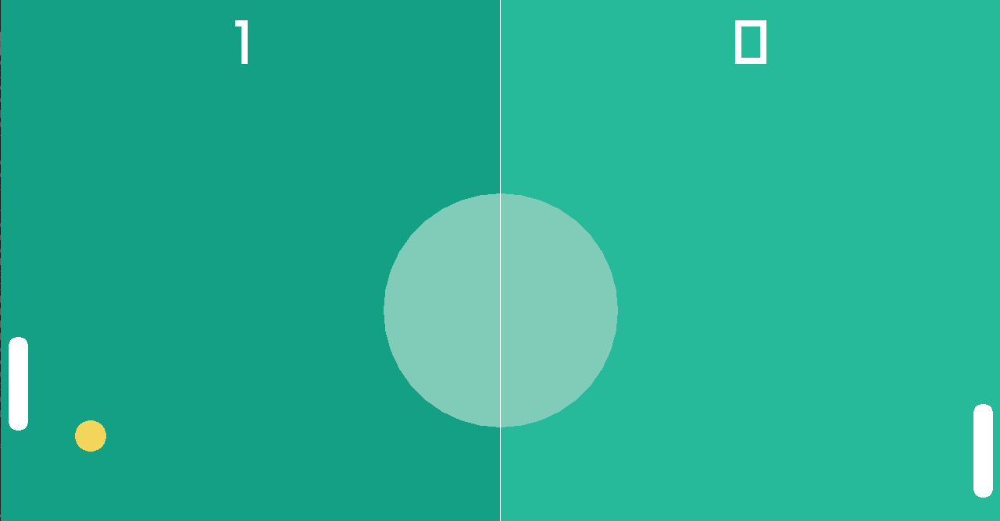

 
  

 

## *Ping-Pong Game*
my goal with this project was to improve my skills with C++ and the Raylib library
  
### Language:
- C++
   
### library:
- Raylib
### commands:
- UP Button
- DOWN Button
  

